# CSS学习笔记

CSS 层叠样式表 : 是一种标记语言

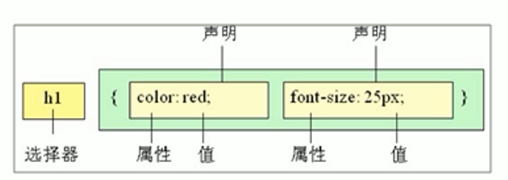

## 选择器

选择器分为==基础选择器==和==标签选择器==两大类。

### 基础选择器

基础选择器是由单个选择器组成的。

#### 标签选择器

标签选择器是指将HTML中的标签作为选择器的名称进行选择。

优点：能够快速为页面中**同类型**的标签统一设置样式。

缺点：不能设计差异化样式，只能选择全部的当前标签。

#### 类选择器

如果想要差异化选择不同的标签，单独选一个或者几个标签，可以使用类选择器。

结构需要使用class属性来调用class类。

```css
    <style>
        .red {
            color: blue;
            font-size: 26px;
        }
    </style>
	<body>
		<li class="red">冰雨</li>
	</body>
```

##### 多类名

1. 我们可以给一个标签指定多个类名，从而达到更多的选择目的。这些类名都可以选出这个标签。简单理解就是一个标签有多个名字。

```html
    <style>
        .red {
            color: red;
        }
        .font35 {
            font-size: 35px;
        }
    </style>
<div class="red font35">刘德华</div>
```

2. 多类名开发中使用场景
    1. 可以把一些标签元素相同的样式放到一个类里。
    2. 这些标签都可以调用这个公共的类，然后再调用自己独有的类。

#### id选择器

id选择器可以为标有特定id的HTML元素指定特定的样式。

HTML元素以id属性来设置id选择器，css中id选择器以"#"来定义。

```html
    <style>
        #pink {
            color: pink;
        }
    </style>
<div id="pink">迈克尔杰克逊</div>
```

注意：样式#定义，结构id调用，只能==调用一次==，别人切勿调用。

##### id选择器和类选择器的区别

id选择器和类选择器最大的不同是在**使用次数**上。

#### 通配符选择器

在css中，通配符选择器使用 "*"定义，它表示选取页面中所有元素（标签）。

```html
* {
	margin:0;
	padding:0;
  }
```

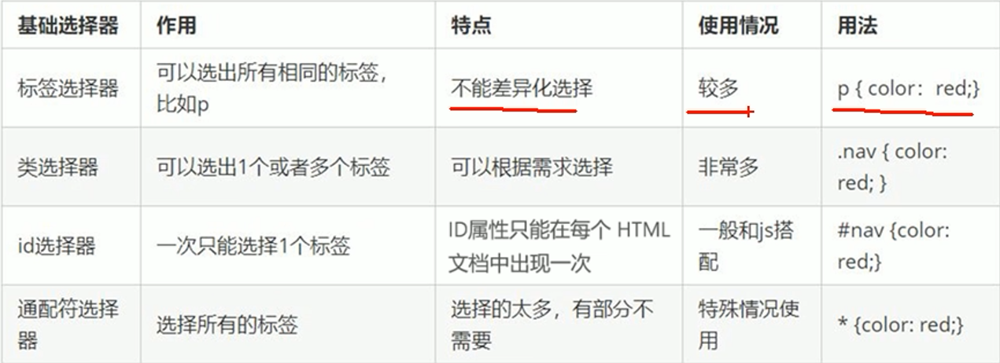

### 复合选择器

复合选择器是由两个或多个基础选择器，通过不同的方式组合而成的。

常用的复合选择器包括：==后代选择器==、==子选择器==、==并集选择器==、==伪类选择器==等

#### 后代选择器

又称 包含选择器

元素1  元素2  {样式声明} 

```html
ol li {
	color: pink;
}
```

元素2可以是儿子也可以是孙子，只要是元素1的后代即可。

#### 子选择器

子元素选择器只能选择作为某元素的最近一级子元素。简单理解就是选择亲儿子。

语法： 元素1  > 元素2 {样式声明}

### 并集选择器

==并集选择器可以选择多组标签，同时为他们定义相同的样式==。通常用于集体声明。

使用逗号分割。

​    div,p {

​      color: red;

​    }

### 伪类选择器

伪类选择器用于向某些选择器添加特殊的效果，比如给链接添加特殊效果，或选择第1个，第n个元素。

使用==冒号 ( : )== 表示 :hover、:first-child 。

分为==链接伪类==、==结构伪类==等。

#### 链接伪类选择器

```html
a:link  /* 选择器所有未访问的链接 */
a:visited  /* 选择器所有已被访问的链接 */
a:hover  /* 选择鼠标指针位于其上的链接 */
a:active  /* 选择活动链接(鼠标按下未弹起的链接) */
```

==注意点==：

1. 为了确保生效，按照LVHA的顺序。
2. a链接有默认样式，链接样式需要单独指定。

#### :focus 伪类选择器

用于选取获得焦点的表单元素。 中间不能加空格。

```html
input:focus {
	background-color: pink;
			}
```

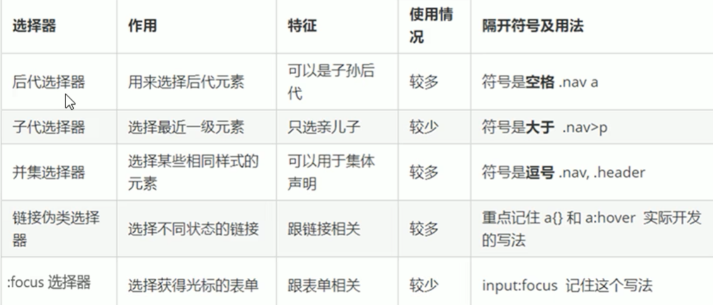

## 字体属性

CSS Fonts（字体）属性用于定义字体系列、大小、粗细和文字样式（如斜体）。

### 字体

font-family

```html
body {
	font-family: 'Microsoft YaHei',tahoma,arial;
}
```

各种字体之间必须使用英文状态下的逗号隔开。

### 字体大小

font-size 属性定义字体大小。

```html
p {
	font-size: 14px;
}
```

标题标签比较特殊，需要特别指定大小。

### 字体粗细

font-weight           700为加粗，和 bold一个效果。 400为正常。

```html
.bold {
	font-weight: bold;
}
```

### 文字样式

font-style  设置文本的风格，斜体。

```html
p {
	font-style: normal; //正常
	font-style: italic; //斜体
}
```

html中的 (em, i)标签也可以表示倾斜。

### 字体复合属性

```body
body {
	font: font-style font-weight font-size/line-height font-family
}
```

前面两个属性可以省略，但必须保留font-size和font-family属性，否则font属性将不起作用。

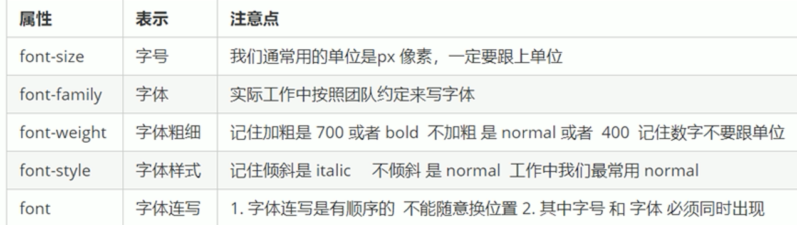

## CSS文本属性


#### CSS Text（文本）

属性可以定义文本的外观，比如文本的颜色、对齐文本、装饰文本、文本缩进、行间距等。

#### 颜色 color

#### text-align 对齐文本     

本质是让盒子里面的文字水平居中对齐。

#### text-decoration 装饰文本

一般用  text-decoration: none;   将超链接里的下划线取消。

或者 ==underline== 可以添加下划线。

```html
a {
	text-decoration: none;
}
```

#### text-indent 首行文本缩进   

10px  2em  

==em==:  是一个相对单位，就是当前元素(font-size) 1个文字的大小。

#### line-height 设置行高

可以控制文字行与行之间的距离。

```html
p {
	line-height: 26px;
}
```

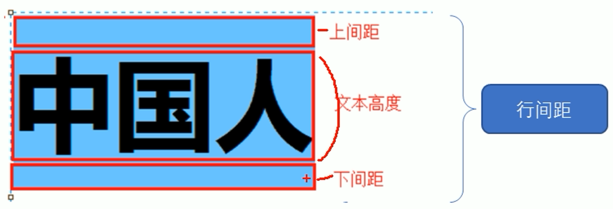

测量行高：从上一行的最下沿到下一行的最下沿。

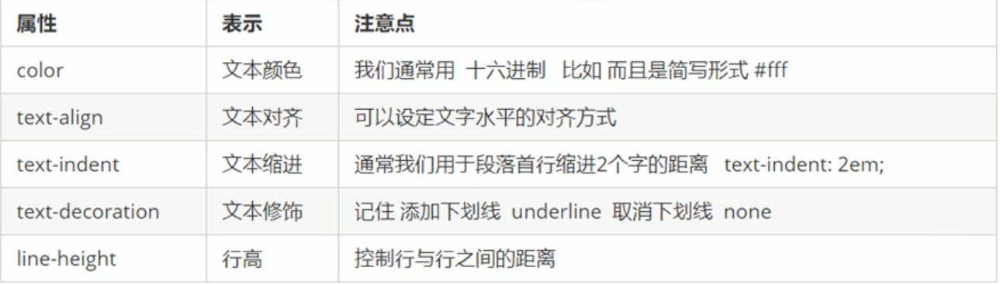

## CSS的引入方式

### 1. 行内样式表

### 2. 内部样式表

### 3. 外部样式表

在html页面中，使用<link>标签引入css文件

```html
<link rel="stylesheet" href="css文件路径">
```

## CSS的元素显示模式

### 块元素

p, div

### 行内元素

span  a   高和宽直接设置是无效的。    只能容纳文本或其他行内元素。

特殊情况：  <a> 里面可以放块级元素，但是转换一下块级模式，最安全。

### 行内块元素

 <input/>  <td> 同时具有块元素和行内元素的特点。

特点

1. 和相邻行内元素（行内块）在一行上，但是他们之间会有空白缝隙，一行可以显示多个。
2. 默认宽度就是它本身内容的宽度
3. 高度，行高、外边距一级内边距都可以控制。

 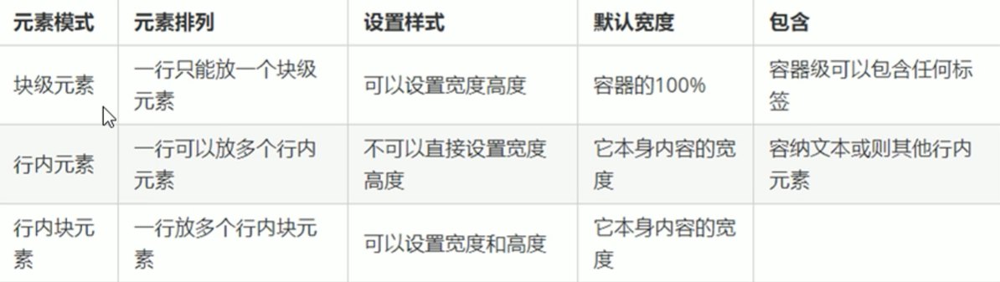

### 元素显示模式转换

特殊情况下，我们需要元素模式的转换，一个模式的元素需要另外一种模式的特性。

比如：想要增加链接<a>的触发范围。

```html
// 转换为块级元素
display: block;
// 转换为行内元素
display:inline;
// 转换为行内块元素
display: inline-block;
```

### 单行文字垂直居中

解决方案：让文字的行高等于盒子的高度。  line-height === height 

==原理==： 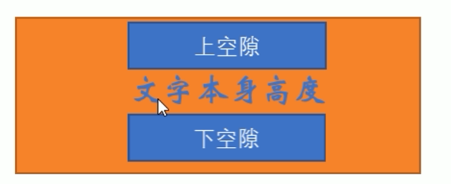

## CSS的背景

### 设置背景颜色

背景颜色透明： background-color: transparent;


### 背景图片 background-image

优点：便于控制位置。

```html
background-image: url();
```

#### 背景平铺

如果需要在HTML页面上对背景图像进行平铺，可以使用background-repeat属性

```html
background-repeat:repeat|no-repeat|repeat-x|repeat-y
```

#### 背景图片位置

background-position

1.参数是方位名词

* 如果指定的两个值都是方位名词，则两个值前后顺序无关，比如left top 和 top left 效果一致。
* 如果只指定了一个方位名词，另一个值省略，则第二个值默认居中对齐。

#### 背景图像固定

background-attachment 属性设置背景图像是否固定或者随着页面的其余部分滚动 。

scroll 背景图像随对象内容滚动。 fixed 背景图像固定。

```html
background-attachment: scroll | fixed
```

#### 背景色半透明

```html
background: rgba(0,0,0,0.3);
//最后一个参数是alpha透明度，取值范围在0~1之间。
```

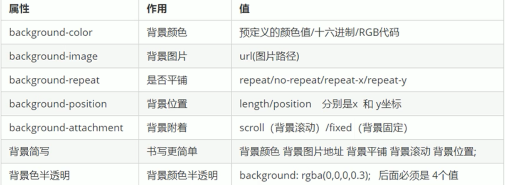

## CSS的三大属性

CSS有三个非常重要的特性： 层叠性、继承性、优先级。

#### 1.层叠性

相同选择器给设置相同的样式，此时一个样式就会覆盖另一个冲突的样式。层叠性主要解决样式冲突的问题。


#### 2. 继承性

字标签会继承父标签的某些样式，比如文本样色和字号。

##### 行高的继承

```html
body {
	font: 12px/1.5  'microsoft yahei'
}
```

body 行高 1.5  写法优势是子元素可以根据自己的字体大小自动调整行高。

#### 3.优先级

当同一个元素指定多个选择器，就有优先级的产生。

* 选择器相同，则执行层叠性。
* 选择器不同，则根据选择器权重执行。

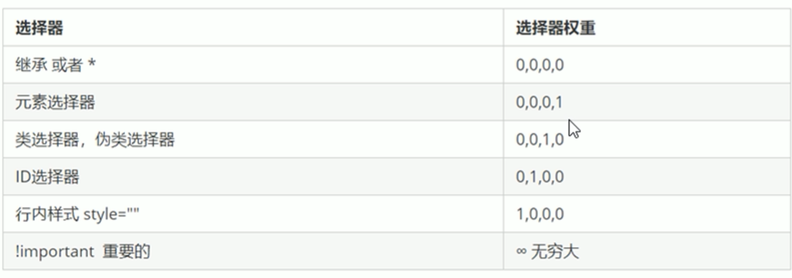

## 盒子模型

CSS盒子模型本质上是一个盒子，封装周围的HTML元素，它包括边框、外边距、内边距和实际内容。

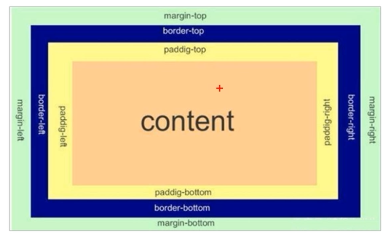

#### 内边距 padding

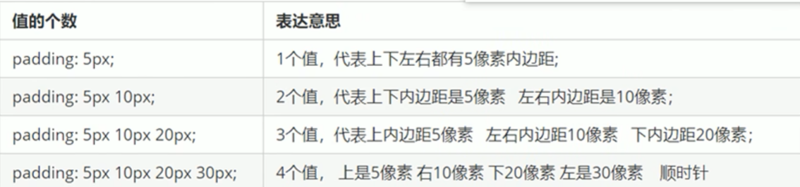

 padding内边距可以撑开盒子，比如说，导航栏中的字数不一样多，我们可以不用给每个盒子宽度，直接给padding最合适。

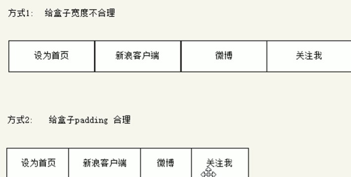

#### 外边距 margin

margin属性用于设置外边距，即控制盒子和盒子之间的距离。