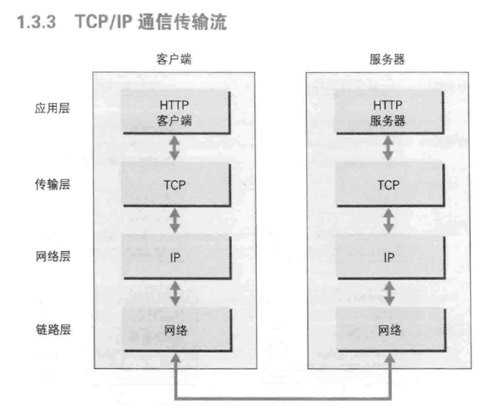
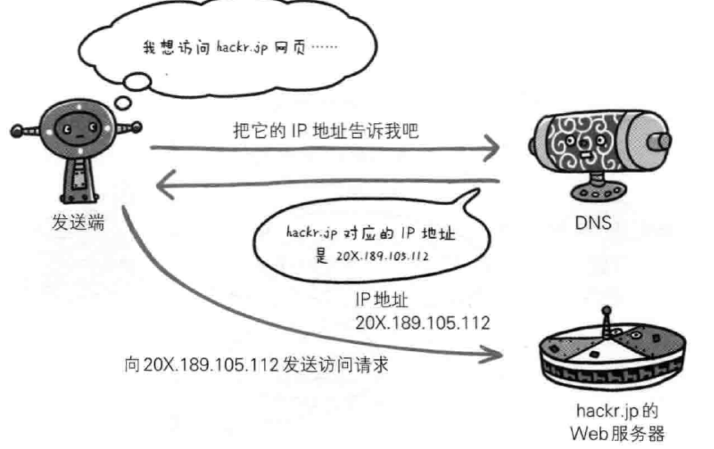
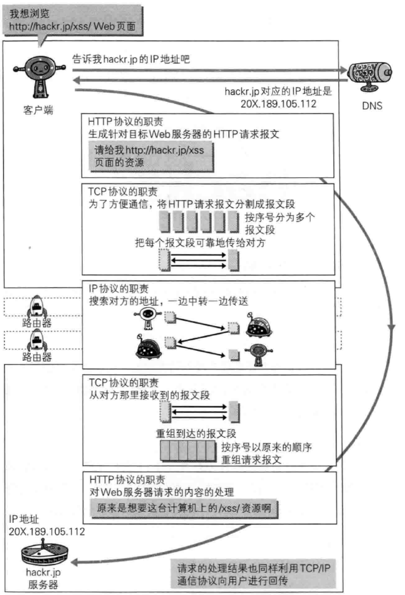

# 图解HTTP

笔记和图片参考：《图解HTTP》 

## 第一章 了解web及网络基础

HTTP： 超文本传输协议 (HyperText Transfer Protocol)

TCP/IP 协议簇 —分层

应用层： 向用户提供应用服务时通信的活动。 FTP... DNS... HTTP

传输层： TCP ... UDP...

网络层： 数据包 ... 传输路线  IP 

数据链路层：处理硬件。

封装：发送端在层与层之间传输数据时，每经过一层时，必定会被打上一个该层所属的首部信息。

==IP协议==

作用：把数据包传送给对方。

前提：需要IP地址（可以更改） 和MAC（Media Access Control Address）地址—网卡所属的固定地址，基本不会改变。

### 三次握手

TCP采用了三次握手策略。 握手过程使用了TCP的标志(flag)— SYN(synchronize)和ACK(acknowledgement).

DNS(Domain Name System) : 域名 → IP地址之间的解析服务

各种协议与HTTP协议的关系：

